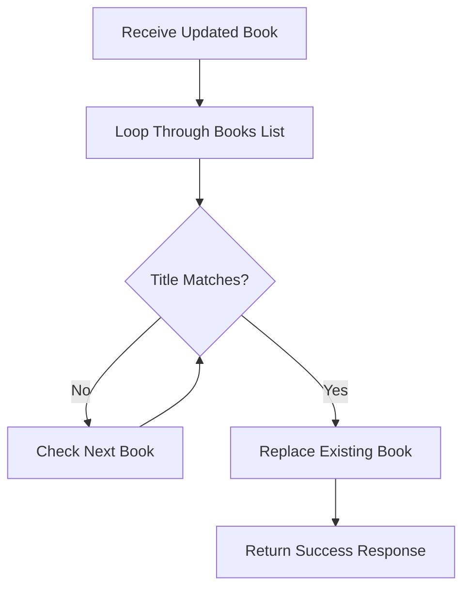

---
{"dg-publish":true,"permalink":"/learning/programming/python/fast-api/section-5-project-1-fast-api-request-method-logic/77-fast-api-project-put-request/","dg-note-properties":{"importance":"high","category":"Programming/Python/FastAPI","creation_date":"2025-11-04 07:55","last_modified_date":"Tuesday 4th November 2025 07:55:21","status":"🟥","up":["[[Section 5 - Project 1 - FastAPI Request Method Logic]]"],"basedon":["[77. FastAPI Project - Put Request](https://www.udemy.com/course/fastapi-the-complete-course/learn/lecture/29025340#overview)"],"course_provider":"udemy","type":"tutorial","modified":"2026-06-18T23:00:05-07:00"}}
---

# 🔄 PUT Request in FastAPI (Update Existing Data)

Until now in Project 1, we have seen:

- **GET requests** → Retrieve data
- **POST requests** → Create new data
- **PUT requests** → Update existing data

In this section, we will learn how to use a **PUT request** to update an existing book.

---

# 🎯 What Does PUT Do?

A **PUT request** is used to **update an existing resource**.

In our example:

- We already have a list of books.
- We want to find a specific book using its **title**.
- Once found, we replace its information with new data.

> Think of it like editing a contact in your phone.
> 
> You search for the contact by name, then update details such as phone number or email while keeping the same contact identity.

---

# 🏗️ Creating the PUT Endpoint

```python
@app.put("/books/update_book")
async def update_book(updated_book=Body()):
```

Here:

- `@app.put(...)` creates a PUT endpoint.
- `updated_book=Body()` receives the updated book information from the request body.

---

# 🔍 Finding the Book to Update

We need to search through the list of books and find the book whose title matches the title sent in the request body.

```python
for i in range(len(books)):
```

This loops through every book in the list.

---

# 🔄 Matching Titles

```python
if books[i].get("title").casefold() == \
   updated_book.get("title").casefold():
```

### Why use `casefold()`?

It performs a **case-insensitive comparison**.

Example:

```python
"Book One".casefold()
```

and

```python
"book one".casefold()
```

both become:

```python
book one
```

So FastAPI can match titles regardless of capitalization.

---

# ✏️ Updating the Book

Once a matching title is found:

```python
books[i] = updated_book
```

This replaces the old book with the new one.

### Example

Before update:

```python
{
    "title": "Title Six",
    "author": "Author Two",
    "category": "Math"
}
```

After update:

```python
{
    "title": "Title Six",
    "author": "Author Two",
    "category": "History"
}
```

---

# 📌 Complete PUT Endpoint

```python
@app.put("/books/update_book")
async def update_book(updated_book=Body()):

    for i in range(len(books)):

        if books[i].get("title").casefold() == \
           updated_book.get("title").casefold():

            books[i] = updated_book
```

---

# 🧪 Testing in Swagger UI

Open:

```text
http://127.0.0.1:8000/docs
```

Make sure the FastAPI server is running:

```bash
uvicorn main:app --reload
```

---

## Step 1: View Existing Books

Execute the GET endpoint and verify the books list.

Example:

```json
[
  {
    "title": "Title One",
    "author": "Author One",
    "category": "Science"
  },
  ...
  {
    "title": "Title Six",
    "author": "Author Two",
    "category": "Math"
  }
]
```

Notice that **Title Six** currently belongs to the **Math** category.

---

## Step 2: Open the PUT Endpoint

Click:

```text
PUT /books/update_book
```

Then click:

```text
Try it out
```

---

## Step 3: Send Updated Data

Request body:

```json
{
  "title": "Title Six",
  "author": "Author Two",
  "category": "History"
}
```

---

## Step 4: Execute the Request

After clicking **Execute**, FastAPI returns:

```text
200 OK
```

This indicates the update was successful.

---

## Step 5: Verify the Update

Call the GET endpoint again.

Updated result:

```json
{
  "title": "Title Six",
  "author": "Author Two",
  "category": "History"
}
```

✅ The category has changed from **Math** to **History**.

---

# 🧠 What's Happening Internally?

When the PUT request arrives:



---

# 📌 Key Points to Remember

✅ **PUT is used to update existing data.**

✅ **Data is usually sent in the request body.**

✅ **The server locates the existing record and replaces or updates it.**

✅ **In this example, the title is used as the unique identifier.**

✅ **`casefold()` allows case-insensitive matching.**

✅ **`books[i] = updated_book` replaces the old book with the new one.**

---

> [!tip]  
> **POST creates new data, while PUT updates existing data.**
> 
> A simple way to remember:
> 
> - **POST → Create**
>     
> - **PUT → Update**
>     
> 
> 🎯 **POST = Add a new book**
> 
> 🎯 **PUT = Edit an existing book**

> [!warning]  
> The current implementation replaces the **entire book object**.
> 
> If you send:
> 
> ```json
> {
>   "title": "Title Six"
> }
> ```
> 
> then all other fields may be lost because the whole object is replaced.
> 
> This is one reason why APIs often use **PATCH** for partial updates and **PUT** for full replacements.