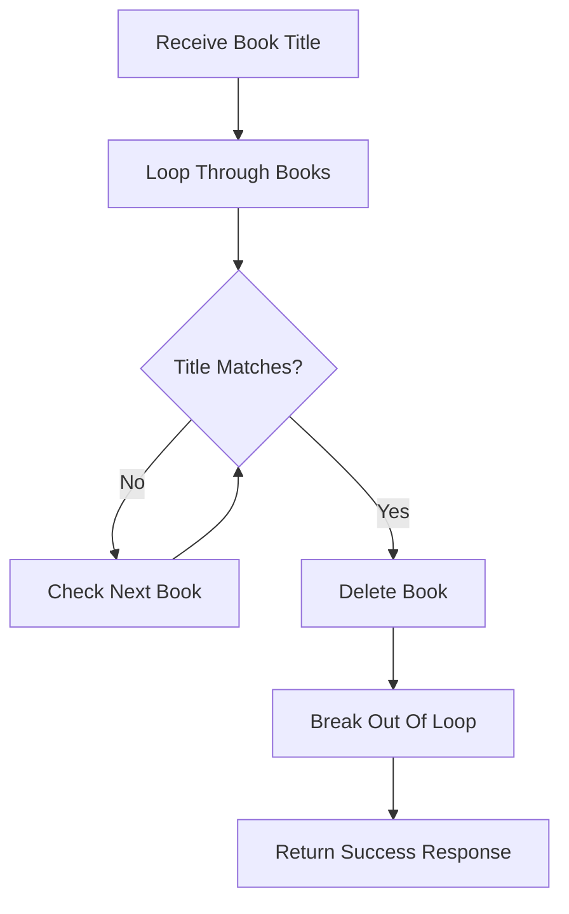

---
{"dg-publish":true,"permalink":"/learning/programming/python/fast-api/section-5-project-1-fast-api-request-method-logic/78-fast-api-project-delete-request-overview/","dg-note-properties":{"importance":"high","category":"Programming/Python/FastAPI","creation_date":"2025-11-04 07:55","last_modified_date":"Tuesday 4th November 2025 07:55:24","status":"🟥","up":["[[Section 5 - Project 1 - FastAPI Request Method Logic]]"],"basedon":["[78. FastAPI Project - Delete Request Overview](https://www.udemy.com/course/fastapi-the-complete-course/learn/lecture/29025340#overview)"],"course_provider":"udemy","type":"tutorial"}}
---

# 🗑️ DELETE Request in FastAPI (Delete Existing Data)

We have now covered most of the common HTTP request methods:

|Method|Purpose|
|---|---|
|**GET**|Retrieve data|
|**POST**|Create new data|
|**PUT**|Update existing data|
|**DELETE**|Remove existing data|

In this section, we'll learn how to use a **DELETE request** to remove a book from our books list.

---

# 🎯 What is a DELETE Request?

A **DELETE request** is used to **remove data from the server**.

For example, suppose our books list contains:

```python
[
    {"title": "Title One"},
    {"title": "Title Two"},
    {"title": "Title Three"}
]
```

If we send a DELETE request for **Title Two**, the result becomes:

```python
[
    {"title": "Title One"},
    {"title": "Title Three"}
]
```

✅ The book is completely removed from the list.

---

# 📌 API Endpoint Structure

The endpoint might look like:

```text
/books/delete_book/{book_title}
```

Here:

```text
{book_title}
```

is a **path parameter**.

Example request:

```text
http://127.0.0.1:8000/books/delete_book/Title Six
```

FastAPI automatically extracts:

```python
book_title = "Title Six"
```

and passes it into the function.

---

# 🏗️ Creating the DELETE Endpoint

```python
@app.delete("/books/delete_book/{book_title}")
async def delete_book(book_title: str):
```

### Breakdown

- `@app.delete(...)` creates a DELETE endpoint.
    
- `{book_title}` is a dynamic path parameter.
    
- `book_title` is received by the function.
    

---

# 🔍 Finding the Book to Delete

We need to search through the list until we find a matching title.

```python
for i in range(len(books)):
```

This loops through every book in the list.

---

# 🎯 Matching the Correct Book

```python
if books[i].get("title").casefold() == book_title.casefold():
```

### Why use `casefold()`?

It performs a **case-insensitive comparison**.

Example:

```python
"Title Six".casefold()
```

and

```python
"title six".casefold()
```

both become:

```python
"title six"
```

This ensures matching works regardless of capitalization.

---

# 🗑️ Deleting the Book

Once a matching title is found:

```python
del books[i]
```

or

```python
books.pop(i)
```

Both remove the book from the list.

---

# 🚪 Breaking Out of the Loop

After deleting the book:

```python
break
```

is used.

### Why?

Once the book is removed, there is no reason to continue searching.

Without `break`, the loop would keep checking the remaining elements unnecessarily.

---

# 📌 Complete DELETE Endpoint

```python
@app.delete("/books/delete_book/{book_title}")
async def delete_book(book_title: str):

    for i in range(len(books)):

        if books[i].get("title").casefold() == \
           book_title.casefold():

            del books[i]
            break
```

---

# 🧠 Internal Workflow



---

# 🧪 Example

## Before Deletion

```python
[
    {
        "title": "Title One",
        "author": "Author One"
    },
    {
        "title": "Title Six",
        "author": "Author Two"
    }
]
```

---

## Request

```http
DELETE /books/delete_book/Title Six
```

---

## After Deletion

```python
[
    {
        "title": "Title One",
        "author": "Author One"
    }
]
```

✅ **Title Six has been removed from the list.**

---

# 🔄 Visualizing What Happens

```text
Books List

[Book 1]
[Book 2]
[Book 3]
[Book 4]
[Book 5]
[Book 6]  ← Match Found

        ↓ DELETE

[Book 1]
[Book 2]
[Book 3]
[Book 4]
[Book 5]
```

The matching book is removed and the list automatically shifts remaining elements.

---

# 📌 Key Points to Remember

✅ **DELETE requests are used to remove existing data.**

✅ **Path parameters are commonly used to identify what should be deleted.**

✅ **The function loops through the collection looking for a match.**

✅ **When a match is found, the item is removed from the list.**

✅ **`break` stops the loop once the deletion is complete.**

✅ **`casefold()` allows case-insensitive matching.**

---

> [!tip]  
> Think of CRUD operations:
> 
> - **Create → POST**
>     
> - **Read → GET**
>     
> - **Update → PUT**
>     
> - **Delete → DELETE**
>     
> 
> 🎯 These four operations form the foundation of most REST APIs.

> [!warning]  
> In a real-world application, data is usually stored in a database rather than an in-memory Python list.
> 
> Instead of:
> 
> ```python
> del books[i]
> ```
> 
> you would typically execute a database operation such as:
> 
> ```python
> db.delete(book)
> db.commit()
> ```
> 
> to permanently remove the record from the database.